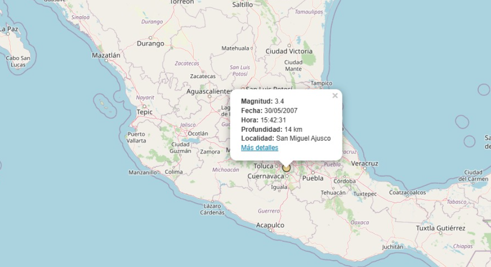
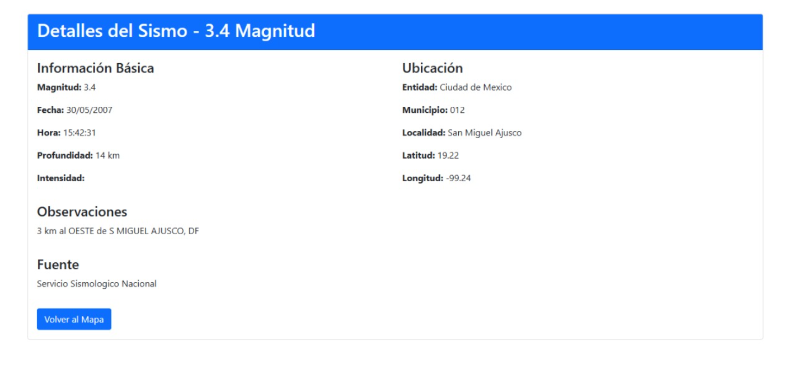
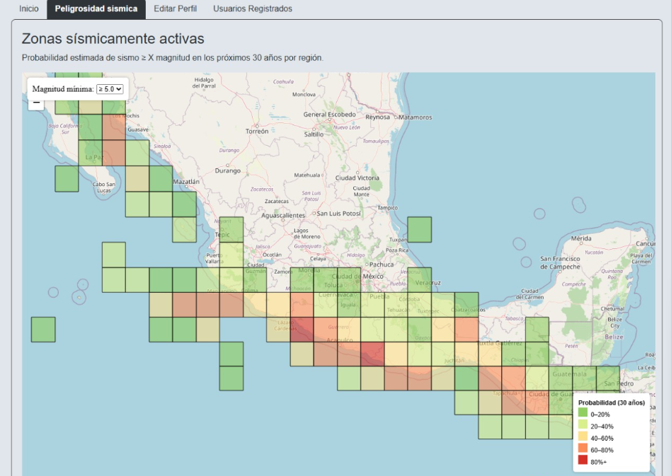
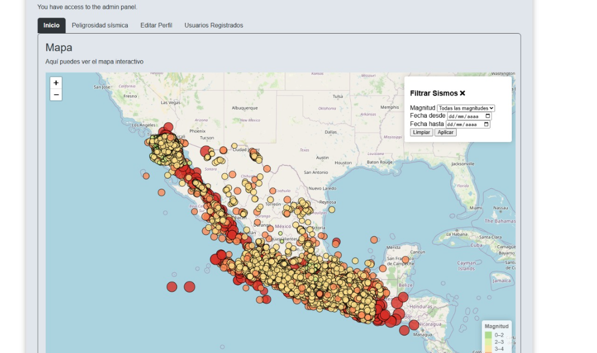
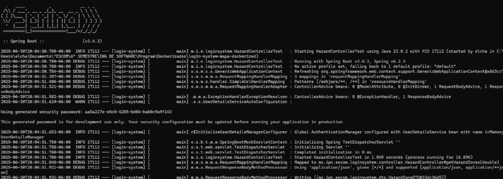

# Sistema de Predicción y Observación de Sismos

Este proyecto es un **sistema de predicción y observación de sismos** desarrollado en Spring Boot, con **autenticación de usuarios** y un frontend minimalista. Utiliza una base de datos MySQL poblada desde un archivo CSV y ofrece vistas de registro y consulta de eventos.

---

## Tecnologías

- Java 17
- Spring Boot
- Maven
- MySQL + phpMyAdmin
- Docker Compose (opcional para base de datos)


## Prerrequisitos

1. **Java 17** y **Maven** instalados en tu máquina.  
2. **MySQL** y **phpMyAdmin**, bien sea instalados localmente o mediante Docker Compose.  
   - Si usas Docker Compose, desde la raíz del proyecto:
     ```bash
     docker-compose up -d
     ```
   - phpMyAdmin quedará disponible en `http://localhost:8080` (por defecto).

---

## Pasos de instalación y ejecución

1. **Abre** la carpeta del proyecto en una terminal.  
2. **Importa** el CSV en la base de datos a través de phpMyAdmin:  
   1. Abre tu navegador en `http://localhost:8080`.  
   2. Accede a la base de datos (por ejemplo `loginsystem`).  
   3. Ve a la pestaña **Importar**.  
   4. Selecciona el archivo `src/main/resources/sismos_mexico.csv`.  
   5. Asegúrate de que:  
      - Formato: CSV  
      - Delimitador de campos: `,`  
      - La primera fila contiene nombres de columna.  
   6. Ejecuta la importación y verifica que la tabla **sismos** se haya poblado.  
3. **Ejecuta** la aplicación Spring Boot:
   ```bash
   mvn spring-boot:run
4. Evidencias y tutorial de uso

   ### Loggeo y registro
   Despues de haber importado el archivo csv a una base de datos y correr el proyecto
   vas a tener la posibilidad de registrarte y loggearte como en cualquier otra pagina web
   
    ### Observar sismos y magnitudes
   Dentro del panel podras tener opciones como la gestion y modificaion de tu informacionde perfil
   y observar los diversos sismos que han emergido dentro de la republica Mexicana por regiones y magnitudes
   
   
    ### Predecir sismos segun la probabilidad de ocurrencia
   Se tiene la posibilidad de predecir sismo en base a los datos obtenidos anteriormente, usando probabilidad
   
   
   Asi funciona la predicción:
   Calcular probabilidad simple usando fórmula de Poisson

   𝑃(𝑛≥1)=1−𝑒^(−𝜆⋅t)

   Por cuadrante se calcula:
   𝜆
   λ = número de sismos ≥ magnitud mínima por año.
   Luego usamos:

   𝑃(𝑛≥1)=1−𝑒^(−𝜆⋅30)
 
   El resultado se transforma en un color para el cuadrante.

6. Dockerizacion
   Es comveniente no dockerizarlo ya que no logramos implementar bien el uso del csv para importar la base de datos
   sin embargo si se logro dockerizar sin problemas, si es que se desea
   
   
