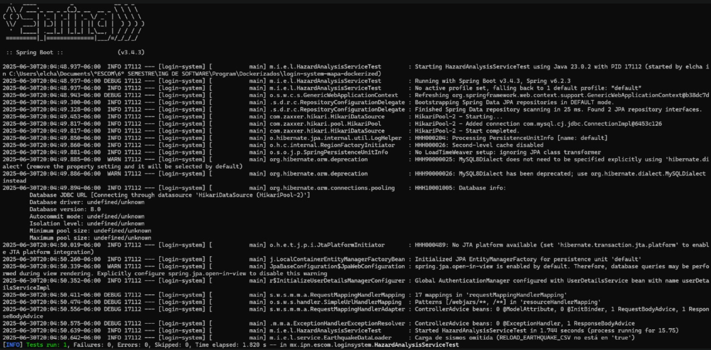
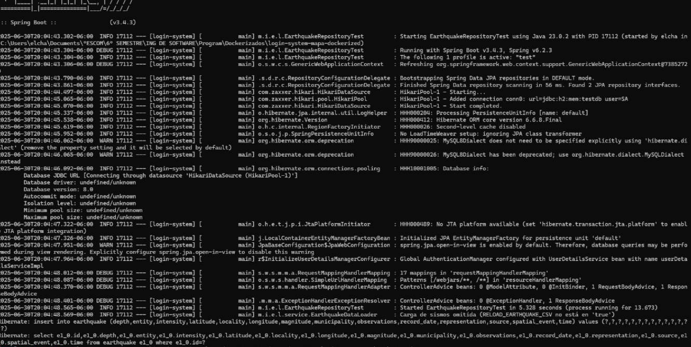
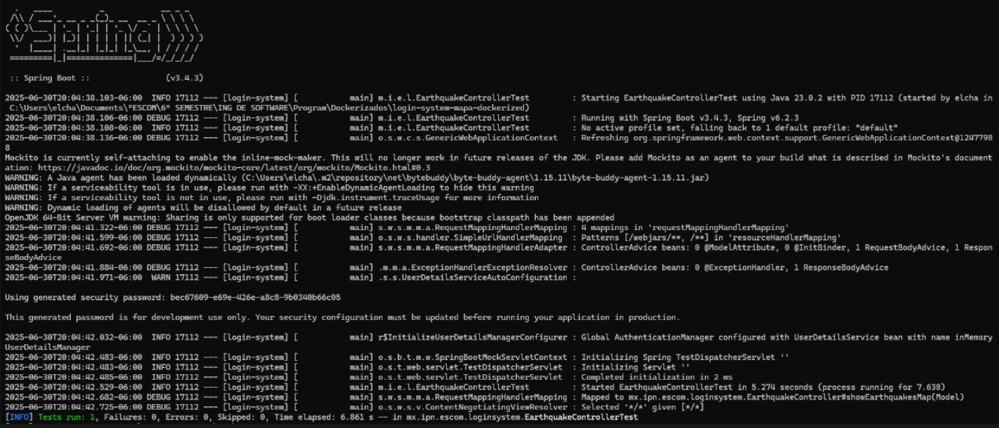
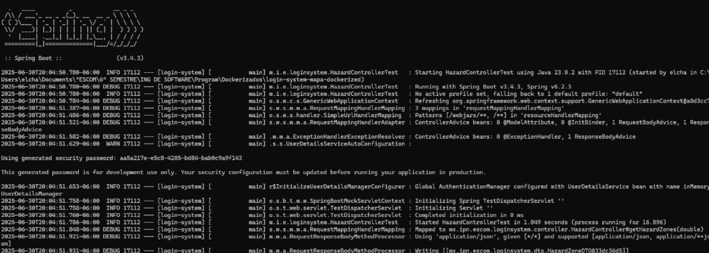
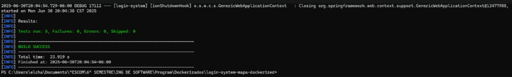

# Pruebas Unitarias y de Integración con JUnit en Spring Boot

Este proyecto incluye pruebas JUnit configuradas para un sistema Spring Boot con base de datos H2 en memoria durante los tests.

---

## ✅ Estructura de Pruebas

- **EarthquakeControllerTest**: prueba el endpoint `/earthquakes` y verifica la vista y el modelo.
- **HazardControllerTest**: prueba el endpoint `/api/hazard` y valida el JSON devuelto.
- **HazardAnalysisServiceTest**: prueba el cálculo de zonas de peligrosidad sísmica.
- **EarthquakeRepositoryTest**: prueba la persistencia de datos en la entidad `Earthquake`.

---

## ⚙️ Configuración necesaria

### 1. Dependencias en `pom.xml`

```xml
<dependency>
  <groupId>org.springframework.boot</groupId>
  <artifactId>spring-boot-starter-test</artifactId>
  <scope>test</scope>
</dependency>

<dependency>
  <groupId>com.h2database</groupId>
  <artifactId>h2</artifactId>
  <scope>test</scope>
</dependency>

<dependency>
  <groupId>org.springframework.security</groupId>
  <artifactId>spring-security-test</artifactId>
  <scope>test</scope>
</dependency>
```

---

### 2. Archivo `application-test.properties`

Ubicación: `src/test/resources/application-test.properties`

```properties
spring.datasource.url=jdbc:h2:mem:testdb;DB_CLOSE_DELAY=-1
spring.datasource.driverClassName=org.h2.Driver
spring.datasource.username=sa
spring.datasource.password=
spring.jpa.database-platform=org.hibernate.dialect.H2Dialect
spring.jpa.hibernate.ddl-auto=none
spring.sql.init.mode=always
```

---

### 3. Archivo `schema.sql`

Ubicación: `src/test/resources/schema.sql`

Este archivo define manualmente la tabla `earthquake` para pruebas con H2.  

---

## 🚀 Ejecución de pruebas

Desde terminal:

```bash
mvn test
```

En caso de usar un IDE como IntelliJ o Eclipse, puedes ejecutar cada clase de prueba individualmente.

Test 1



Resultado: El test fue ejecutado sin errores, fallos ni tests omitidos. ¡Éxito!

Test 2



Esto indica que las pruebas están haciendo inserciones y consultas correctamente en una base de datos de prueba. No se ve ningún mensaje de error ni excepción.

Aunque no hay línea final explícita como en la anterior, el flujo indica ejecución normal y sin fallos.

Test 3



Resultado: Nuevamente, el test fue exitoso. Sin errores ni fallos.

Test 4



Las pruebas (JUnit) se ejecutaron correctamente para los tests de:

HazardAnalysisServiceTest

EarthquakeRepositoryTest

EarthquakeControllerTest

No hubo errores, fallos ni tests omitidos. Todo está funcionando correctamente.


---

## 🔐 Seguridad en pruebas

Los controladores protegidos por Spring Security usan:

```java
@WithMockUser(username = "admin", roles = {"USER"})
```

para evitar errores `401 Unauthorized` durante los tests.

---

## 🛠️ Notas adicionales

- Si Hibernate no genera tus tablas automáticamente, asegúrate de usar `schema.sql` y establecer `ddl-auto=none`.
- Los tests de integración usan `@SpringBootTest` y `@ActiveProfiles("test")`.
- Se utilizaron mocks con `@MockBean` para servicios dependientes.

---

---

## ✅ Resultado Final

Al final, deberías ver una salida como:

```text
BUILD SUCCESS
Tests run: 5, Failures: 0, Errors: 0, Skipped: 0
```

BUILD SUCCESS



---
